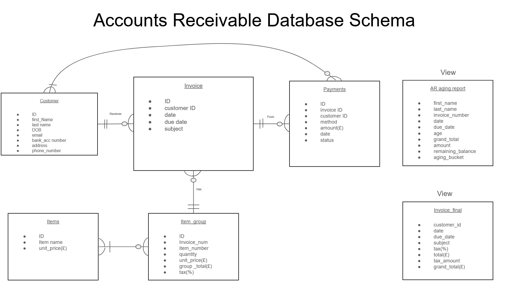

# SQL---Accounts-Receivable-Database
# Accounts Receivable Database

By John Haidoulis

## General summary

An accounting database to store invoices and payments from customers. Users can generate summary balance sheets for a given period and essential business KPIs.

## Scope

* The purpose of this database is to store important financial/accounting data (primarily accounts receivable data) to track customer invoices and report on key performance indicators (KPIs) for a made-up business. 
This database is designed to be used in PosgreSQL. 
A user should be able to query anything to do with money paid into this made-up business and then generate KPIs on these data for given dates and customers.
* This database is limited to collecting customer data, invoices, items that are sold, payments, and aggregating reports on accounts receivable and final invoices.
* This database does not include accounts payable data, expenses that the business might have (and thus other types of KPIs that require this data), employee data, and branches for this business. This database does not include any other financial data outside the scope of a single buisness's account receivable. 
The user will also not be able to investigate any other assets of this business other than cash, accounts receivable, and calculations of these two variables.

## Database Schema

## Python Script

* The attached script is used to connect to a given database and upload fake data for each table to test important queries and views.
* Important Note: To run, the user must be connected to a local or server PostgreSQL database and input all the necessary details in the "conn" variable (Line 13-17). 
* All the fake data for every column is generated from the Faker module. As a result, some of the queries and view values will not make much sense. 
* This script is only for inserting data into the database. 

## KPIs

### There are two main Views that were generated as these are essential business reports: Final invoice and AR_aging report.
* The final invoice is an important aggregating table that combines invoice and items that includes tax to calculate the grand_total invoice for each customer. This report is essential to calculate other KPI reports like yearly balance sheet, days sale outstanding, and Accounts Receivable turnover.
* The AR_aging report is one of the KPIs used to track unpaid customer invoices and remaining balances. Here is where due_dates and payments are useful to start to predict the cash flow of this business. Importantly the data is partitioned to put the different invoices in different age buckets based on how old the invoice is.

## Limitations

* The customer table is not yet anonymised for any user that shouldnt have access to this data.
A phone number and other contact details for the customer might be necessary.
* Within the scope of the project, it will not account for customers that pay in installments with interest, a loan, or cash (in person).
The balance sheet is incomplete: The final assets aren't the whole picture required for the balance sheet as other data like expenses and outgoings are required.

### References:

These .sql files are from my CS50SQL Final project witha few changes to the schema and queries.

[Setting up the Python script framework](https://youtu.be/M2NzvnfS-hI?si=BqAvKK8kNlu4cXEE)

PostgreSQL database extensions:
 * SQLTools by Matheus Teixeira
 * SQLTools PostgreSQL/Cockroach Driver by Matheus Teixeira

